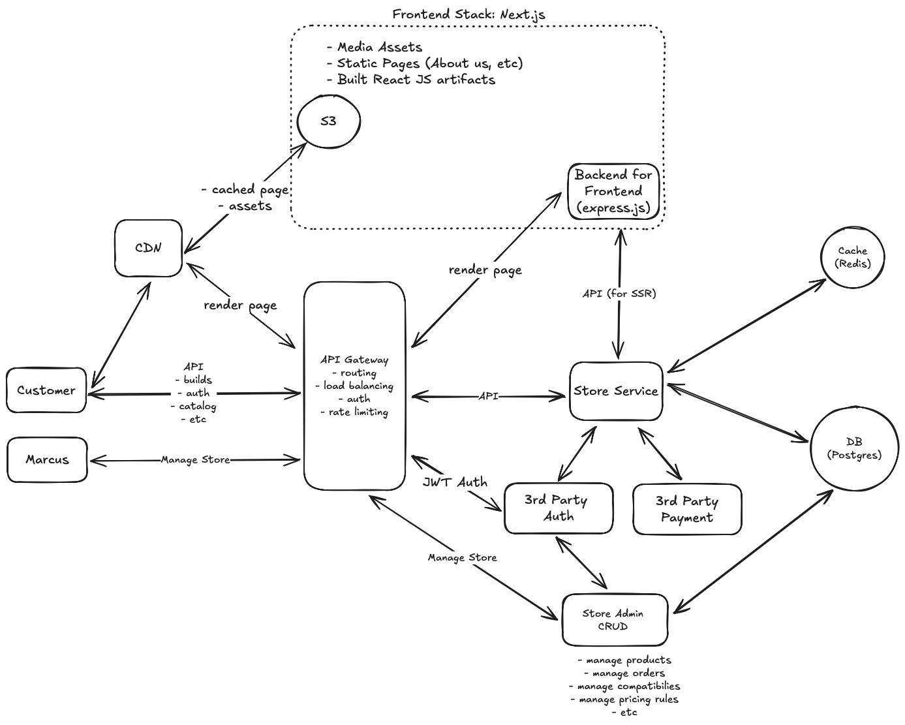
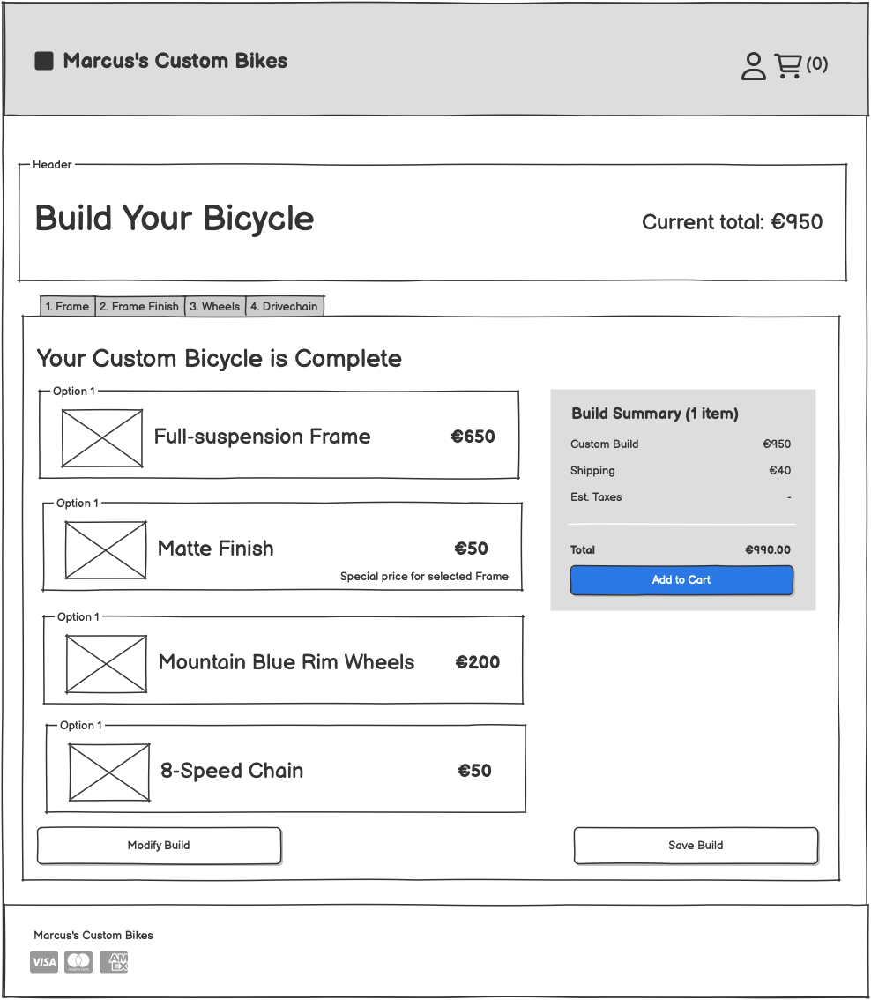
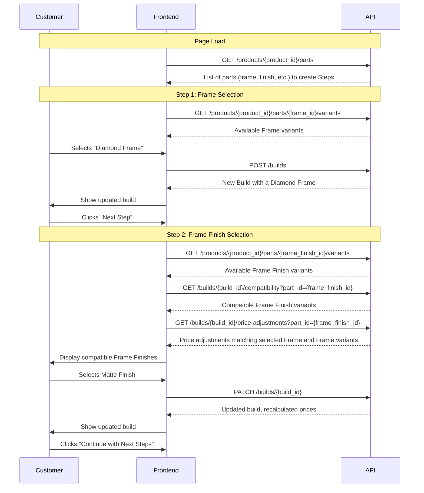

## Requirements
- Frontend and Backend are split and communicate via API
- [Marcus store description](./docs/requirements.md)

## Assumptions

### Core Vocabulary
- Product: Defines a set of custom built sport goods such as bicycle, ski, skateboard, surfboard
- Part: Defines components that a product is composed of, such as wheels, frames, etc.
- Part Option: Attributes like color, size, material, etc.
- Part Variant: An individual stock unit with defined set of options (e.g., "Shiny Red Diamond Frame")

### Business & Product Rules
- Marcus picks the best manufacturer/model for each part, simplifying user experience
    - He can introduce premium/normal options to offer different tiers in the future
- Each part can have multiple option dimensions
    - e.g., wheel has size, type, width, color
    - These dimensions are needed to correctly track stock for specific combinations
- All parts are required for the build 
    - platform can be extended for optional parts later
- Marcus takes care of quantities 
    - users don't have to add 2x wheels
- Frame finish is done by Marcus
    - Does not affect stock of the frame
    - Needs to track stock of the finish (paint)
    - Additional price charge depends on the frame option
- Rim color is not a standalone "part", but another option of the wheel
    - Comes in color from manufacturer
    - Need to track stock of available wheel type/rim color/size combinations
- Pricing and compatibility rules are 
    - Matched on multiple conditions for target and source part.
        - Example, for a L-size diamond frame => Shiny golden finish is more expensive
        - For a Mountain wheel size 25 => 8-speed titanium chain installaition is not compatible
    - Support include and exclude semantics. Up to Marcus to decide how to best manage rules to avoid errors

### Technical Implementation Scope
To maintain focus on the core functionality of managing product configurations, price calculations, and parts compatibility, this implementation will have a reduced scope. Some standard e-commerce features will be simplified, omitted, or delegated to third-party services.

#### In Scope (Simplified)
- Inventory: Basic binary stock status tracking for part variants
- Customer data: Simplified personal details (address, billing info)

#### Out of Scope
- Media management: Products, Parts, and Variants should have multiple images/videos
- Authentication: Delegated to 3rd-party services (Cognito, Supertokens, etc.)
    - auth related DB tables are omitted
- Payment processing: Integration with 3rd-party services like Stripe

### Additional Future Functionality
- Social Features
    - Popular builds
    - Sharing builds with friends
    - Commenting on builds
- User Experience
    - Saving builds for later
    - Filtering parts by options  
    - Search for a part/build
- Sales Features
    - Buying accessories that complement builds or standalone
    - Customer notifications and marketing campaigns
- Store management
    - Backoffice authentication and role management
    - Detailed inventory management and automated restocking
    - Audit trails for catalog and order changes
    - Advanced shipping options and shipment process management
    - Returns and RMA handling
- Performance & Monitoring
    - Monitoring and alerting for errors and performance issues


### Performance Considerations
- Assume the shop operates with bicycles (but ready to onboard more products) and curated list of part options
- No pagination is required to fetch/display part variants for now
- While constantly gaining popularity, overall number of concurrent users is low
- Marcus does NOT update his inventory or catalog more than several times a day

## System Design Diagram

The system architecture implements:

- Separate Frontend and Backend (according to requirements): Next.js frontend with Rails API backend
- SEO Optimization: Server-Side Rendering for improved search engine visibility
- Isolated Admin System: Separate user pool and deployment for store management

This split architecture allows the customer-facing platform to leverage Next.js's SEO benefits while the admin interface can use a simpler server-rendered CRUD approach.


 


## Database Schema
- [Database schema](./database/schema.sql) is available with detailed comments for all entities.
- [ER Diagram](./docs/factorial_er.png) image for adventurous souls

## Mockups
- [Home Page](./docs/wireframes/home.png)
- [Bike Customization Page](./docs/wireframes/bike_customization.png)
- [Bike Customization Final Step Page](./docs/wireframes/bike_customization_final.png)

## User Actions
A customer should be able to:
- [Visit Home Page](./docs/wireframes/home.png), and 
    - See detailed information about bicycles (and more products in the future)
    - Start a fresh custom bike build by clicking on CTA
    - Start a featured build customization by clicking on CTA
- Have an account
    - Signup, login, etc.
    - See a history of his orders
    - View individual order details and status
    - View a list of his custom builds
    - Preserve anonymous builds/cart after logging in
- [Build Custom Bicycle](./docs/wireframes/bike_customization.png) (and other products in the future)
    - Start a fresh build
    - Modify existing build (their own or featured by store)
    - A build process is divided in steps corresponding to each Part
    - At each step, a customer should:
        - See available part variants (color, size, etc) with clearly highlighted compatible ones
        - See available (in stock) part variants and their prices
        - Clearly see additional price when a price rule was triggered (matte finish on full suspension frame has higher price) 
        - Select a compatible part variants
        - Deselect one of selected parts
        - NOT be able to select incompatible part variants
        - See total price for selected parts
        - Progress to next step until the [final step](./docs/wireframes/bike_customization_final.png)
        - Save current build with custom name for future reference
    - Complete a build by selecting a viable option for each part
    - Add completed build to the shopping cart
- Buy custom bicycles (and other products in the future)
    - Visit his shopping cart, unless it is empty
    - See builds, quantities and price for each one with detailed outline by part
        - Build details should clearly include additional prices (matte finish)
    - Adjust quantities or remove builds from cart
    - Start checkout process
        - Go through registration/auth flow unless user is logged in
        - Provide shipping details
        - Review his order details again, with build, quantities, prices, shipping, etc
        - Confirm order and be taken to complete payment
        - See successful order notification and see order details
    - View a history of his orders
    - View details of individual order
        - Have clear itemization of which builds it included, quantities, additional price charges
        - Status of the order (pending payment, payment received, assembling, shipped, etc)

## Product Customization Builder
The product builder interface guides customers through a step-by-step process to configure their bicycle or other products. Each step focuses on selecting a specific part, highlighting compatible options based on previous selections. Customers can go back to change earlier choices at any time.
The interface shows the current total price, including any adjustments for specific part combinations (e.g., matte finish on a diamond frame).

### Builder mockup
 

### Requests Flow of Building a Bicycle
For a customer that navigated to product builder page to start a **fresh** custom build, request flow would be following:

### Compatability Rules
#### Approaches
Before diving into the compatibility endpoint details, let's examine our options for configuring and storing compatibility rules in the database. We face a tradeoff between rule expressiveness/flexibility and the complexity of storage, management, and calculation during builds. Some approaches may require caching precalculated values in auxiliary services like Redis (for sets).

1. Compatibility defined between two parts variants. Most simple approach. A strict one to one match. For example, Wheel Size 22 with Blue Rim is compatible with Narrow Tire Size 22. A table in database would look like 

```sql
CREATE TABLE part_variant_compatibility (
    id UUID PRIMARY KEY,
    product_id UUID NOT NULL REFERENCES products(id),
    part_variant_1_id UUID NOT NULL REFERENCES part_variants(id),
    part_variant_2_id UUID NOT NULL REFERENCES part_variants(id),
    compatibility_type VARCHAR(10) NOT NULL DEFAULT 'INCLUDE', -- 'INCLUDE' or 'EXCLUDE'
    active BOOLEAN DEFAULT TRUE,
    created_at TIMESTAMP,
    updated_at TIMESTAMP,
    CONSTRAINT variant_ids_ordered CHECK (part_variant_1_id < part_variant_2_id),
    UNIQUE(part_variant_1_id, part_variant_2_id)
);
```
While this approach is simple to implement and fast to query, it becomes burdensome to manage as the store adds more variants. The store owner must manually define compatibility rules for an increasing number of option permutations, creating a significant maintenance challenge. It will become a burdain to manage as store gets more variants. Store owner has to keep up with defininig these rules for a lot of option permutation.

2. Compatibility defined between option values. This approach uses many-to-many matching based on characteristic pairs. For example, 'All mountain wheels work with full-suspension frames regardless of other features.' This rule applies broadly across multiple product variations sharing these characteristics.

```sql
CREATE TABLE option_value_compatibility (
    id UUID PRIMARY KEY,
    product_id UUID NOT NULL REFERENCES products(id),
    option_value_1_id UUID NOT NULL REFERENCES option_values(id),
    option_value_2_id UUID NOT NULL REFERENCES option_values(id),
    compatibility_type VARCHAR(10) NOT NULL DEFAULT 'INCLUDE', -- 'INCLUDE' or 'EXCLUDE'
    active BOOLEAN DEFAULT TRUE,
    created_at TIMESTAMP,
    updated_at TIMESTAMP,
    CONSTRAINT option_value_ids_ordered CHECK (option_value_1_id < option_value_2_id),
    UNIQUE(option_value_1_id, option_value_2_id)
);
```
This approach trades query complexity for reduced rule management. New items automatically inherit existing rules—for example, any new mountain wheel or full-suspension frame will match the previously defined rule. The lookup now requires complex joins.
However, this approach has limitations:

- It cannot properly express AND/OR relationships in conditions (e.g., 'Wheel Size 22 AND Mountain type is compatible with Full Suspension frame')
- It only supports conditions between pairs of parts

The matching process for a candidate variant must satisfy these criteria:

- Must exist in the target variants list
- Must satisfy all inclusion rules for all selected variants
- Must not appear in any exclusion rules of any selected variant

3. Compatibility defined by composite conditions. This approach enables complex expressions such as 'Wheel Size 22 AND Wheel type Mountain AND Frame Full Suspension are compatible.' It allows for multi-factor compatibility rules that combine multiple attributes across different parts..

```sql
-- Compatibility Rules Table
CREATE TABLE compatibility_rules (
    id UUID PRIMARY KEY,
    product_id UUID NOT NULL REFERENCES products(id),
    name VARCHAR(255) NOT NULL,
    description TEXT,
    active BOOLEAN DEFAULT TRUE,
    compatibility_type VARCHAR(10) NOT NULL DEFAULT 'INCLUDE', -- 'INCLUDE' or 'EXCLUDE'
    created_at TIMESTAMP,
    updated_at TIMESTAMP
);

-- Rule Entries Table 
CREATE TABLE compatibility_rule_conditions (
    id UUID PRIMARY KEY DEFAULT gen_random_uuid(),
    rule_id UUID NOT NULL REFERENCES compatibility_rules(id),
    part_id UUID REFERENCES parts(id),
    option_value_id UUID REFERENCES option_values(id) ,
    created_at TIMESTAMP
);
```
This approach offers greater flexibility but introduces additional complexity. The application must verify rule integrity, and matching now involves evaluating multiple conditions simultaneously rather than simple pairs. This increases both processing requirements and the potential for logical conflicts.

4. We can continue incrementally making our rule definitions more loose until eventually they become some sort of expression language 
```sql
CREATE TABLE compatibility_rules (
    id UUID PRIMARY KEY DEFAULT gen_random_uuid(),
    product_id UUID NOT NULL REFERENCES products(id),
    active BOOLEAN DEFAULT TRUE,
    constraint_expression TEXT NOT NULL, -- custom logic expressions
    description TEXT
);
```

#### Chosen approach
Taking a pragmatic approach, I'll select a solution that's flexible enough to meet our requirements while minimizing complexity overhead. The implementation should also keep pathways open for future data model enhancements. This would be an ideal time to discuss real-world use cases with Marcus.
For now, I'll implement a hybrid solution combining options 1 and 2. This approach will allow Marcus to define many reasonable rules that satisfy our requirements. If edge cases arise between specific parts, Marcus can leverage option 1 to address these exceptional situations.

### Price Adjustments
Price adjustment rules, such as those for Matte Frame Finish, follow similar patterns to compatibility rules and face the same tradeoffs. For this functionality, I'll implement option 2 exclusively. In the future, we can either supplement with option 1 or explore more complex solutions in parallel with compatibility rule enhancements.

## Implementation
You will find price and compatibilitity partial implementation under `./src` with relevant tests under `./spec`. More details about implemented service later in this section. I've only created the models we actually need to run compatibility checks and price adjustments within the Ruby application. And even though I'm assuming this will be part of a Rails app, I've kept the implementation limited to just ActiveRecord without pulling in Rails or any other unnecessary gems.

This is a simplified implementation with a few assumptions:

- The store will have way more reads than writes
- Compatibility rules won't change much, except when adding new variants/products
- A small delay on first load is fine - users won't really notice it
- Memory shouldn't be an issue for quite a while. Less than 500mb to cache 1000 varitans. I provided some estimation in comments to code.
- Pricing or compatibility services don't check stock status - that info comes from `GET /products/{product_id}/parts/{part_id}/variants`

Once Marcus gets a lot more popular worldwide, we can look into different ways of handling the cache. For example, we could keep sets of compatibilities pre-calculated in Redis. This would add some complexity with data syncing (through change data capture) and cache invalidations. But Marcus has a long way to go before we need to worry about that.

### Running Tests
- Run `docker-compose up` to bring up Redis and Postgres databases
- Migrate database manually, using `./database/schema.sql`
- Install and use `rbenv` to set ruby version for the project
- Install gems `bundle install`
- Update database access in `./src/app/config/database.yml`
- Execute specs `rspec`

### Compatibility Endpoint 
To fetch IDs of "Frame Finish" variants compatible with current build, we would call the endpoint

```
   GET /builds/{build_id}/compatibility?part_id={frame-finish-part-id}
   ```
   Response:
   ```json
   {
     "compatible_variant_ids": ["finish-variant-1", "finish-variant-2"]
   }
   ```

 On the backend a controller would process request to this endpoint, and would call a compatibility service.
 ```ruby
  # GET /builds/:id/compatibility
    def compatibility
      # Code to get product, target_variants and selected variants from DB
      # With errors on missing part or no selected variants, etc
      
      # Use the compatibility service to determine compatible variants
      compatible_variants_ids = CompatibilityService.get_compatible_variants_ids(
        product: product,
        selected_variants: selected_variants,
        target_variants: target_variants
      )
      
      # Return IDs
      render json: { compatible_variant_ids: compatible_variants_ids }
    end
 ```


### Compatiblity Calculations
I've put the implementation in [compatibility_service.rb](./src/lib/parts/compatibility_service.rb) with the specs in [compatibility_service_spec.rb](./spec/lib/parts/compatibility_service_spec.rb).

### Price Adjustment Endpoint
To fetch price adjustments for "Frame Finish" variants of the current build we would call the endpoint
```
GET /builds/{build_id}/price-adjustments?part_id={frame-finish-part-id}
```
Response:
```json
{
  "adjusted_prices": [
     {
        "rule_id": "rule-1-id",
        "variant_1_id": "variant-1-id",
        "variant_2_id": "variant-2-id",
        "amount": 15.00,
        "name": "Premium Matte on Diamond",
        "description": "Premium matte finish on diamond frames",
     },
  ]
}
```

### Price Adjustment Calculations
Price adjustment will follow the same approach as compatibility, but with simpler rules (they'll only be option-based and only use INCLUDE).
I've put the implementation in [pricing_service.rb](./src/lib/parts/pricing_service.rb) with the specs in [pricing_service_spec](./spec/lib/parts/pricing_service_spec.rb).

## 4. Add to Cart Action
When the user clicks the 'Add to Cart' button, here's what happens:
- The frontend sends a request to the API to add the selected build to the cart
- CHECK if build is valid: items in stock and compatible
    - if not, return an error
- If there isn't one already, a new `shopping_cart` gets created for the customer
- If it's not there yet, a new `shopping_cart_builds` entry is created for the selected build, adding it to the cart
- If the shopping cart already has this build, we just bump up the quantity
- The API confirms the build was added to the cart
- The frontend updates the cart UI to show the new build and total price
- Price adjustments get fetched on the fly from the price-adjustments API for each build

Additional considerations in the checkout process:
- We should think about the UI/UX for when a user goes back to edit a build that's already in their cart (like warning about price changes, removing invalid builds from the cart, etc.).
- Once the order is confirmed/created, we store not just a foreign key to the build, but also references to all the build parts with copies of their info (sku, name, price, etc.). This makes sure that if Marcus changes a part's price later, the order history stays intact and shows the prices as they were when the customer made the purchase.
- Before creating the order, we can run the pricing and compatibility services without the cache layer. It might be a bit slower, but it ensures we have the most up-to-date information. Though honestly, this is debatable - we don't really expect compatibilities to change, and even if there's a new pricing rule, it might just show up 5 minutes later on a different order anyway. But for now, running without cache at this point shouldn't hurt anything


## Administrative Workflows
### Product Creation
To add a new product (e.g., a Skateboard) to the store, we'll need to create the following records:
- Create Product Record
   - Add to `products` table
   - Required: name ('Skateboard'), product_key ('skateboard')
- Define Product Parts
   - Add to `parts` table
   - Required: names ('Deck', 'Wheels'), part_keys ('deck', 'wheels'), product foreign key
- Set Up Part Options
   - Add to `options` table
   - Required: names ('Color', 'Size'), option_keys ('color', 'size'), part foreign keys
- Add Option Values
   - Add to `option_values` table
   - Required: values ('Red', 'Blue', '8"', '10"'), part option foreign keys
- Create Sellable Variants
   - Add to `part_variants` table with names, SKUs, prices, part and product references
   - Create option value associations in the `part_variant_option_values` join table

The final part variants are what customers can purchase, each with specific options, unique SKU, and inventory status.

#### Adding New Rim Color
Here's a more conversational version:

"The UI for managing products and related records would be basically a table view with records in rows.

To add a new Rim Color, Marcus would need to:
- Navigate to 'Bicycle Product > Wheels Part' to see the individual part details
- On this page, he'd see a list of existing options (Size, Type, Rim Color, etc.) and their values next to each other in a table
- He'd click the 'Add new value' button next to the Rim Color option
- A modal would pop up with a form to add a new Rim Color value
- He'd fill in the form with the new Rim Color value and click 'Save'
- The new Rim Color value would then be added to the table of Rim Color values
- We'd make sure the new value is unique

On the database side, this would create a new record ('Red') in the `option_values` table with a foreign key to the `options` table ('Rim Color') that references the `parts` table ('Wheels') for the product ('Bicycle')."


#### Changing Part Prices or Combination Pricing
A UI displays all product variants with filters for SKU, color, size, and other options.
- Marcus navigates to `Bicycle Product > All Variants`
- He views the variants list with their prices
- He locates and edits a specific variant price
This updates the `price` column in the `part_variants` table.

To create a combination pricing rule, Marcus:
- Goes to `Bicycle Product > Pricing Rules`
- Clicks `Add New Rule`
- In the popup form:
  - Selects first part (Frame) > option (Type) > value (Diamond)
  - Selects second part (Frame Finish) > option (Type) > value (Matte)
  - Enters price adjustment (15.00), name and description
  - Clicks `Save`
- The new rule appears in the rules list

This creates a record in `price_adjustments` (Matte finish costs more on Diamond Frame) with foreign keys to `product` (Bicycle) and `option_value` (Diamond, Matte) tables.
The application ensures option values reference different parts of the same product.


## API Specifications

### Available Endpoints

API endpoints are a high level draft of RESTful endpoints to support application and most of them would return relevant resource fields in JSON format.

#### Products
- `GET /products` - Get product list
- `GET /products/?key={product_key}` - Get product details by key
- `GET /products/{product_id}` - Get product details by ID
- `GET /products/{product_id}/parts` - Get product parts
- `GET /products/{product_id}/parts/{part_id}/variants?page={}&offset={}` - Get part variants


#### Build Operations
While builds do belog to products, unlike parts, I believe it's a top level concept for this shop and as such, I did not nest the API resource

- `GET /builds?product_id={id}&page={}&offest={}` - Get builds
- `POST /builds` - Create a new build with first selection
- `GET /builds/{build_id}` - Get specific build details
- `PATCH /builds/{build_id}` - Update build (name, add/remove parts)
- `DELETE /builds/{build_id}` - Delete a build
- `GET /builds/{build_id}/compatibility?part_id={part_id}` - Get compatible part variants with other selected parts of the build
- `GET /builds/{build_id}/price-adjustments?part_id={part_id}` - Get special pricing for part variants

#### Shopping Cart
- `GET /cart` - View cart contents
- `POST /cart/items` - Add item (build) to cart
- `PATCH /cart/items/{item_id}` - Update cart item (build) quantity
- `DELETE /cart/items/{item_id}` - Remove item (build) from cart

#### Orders
- `POST /orders` - Create new order
- `GET /orders/{order_id}` - Get single order
- `GET /orders?page={}&offset={}` - List all orders
- `GET /orders/{order_id}/builds` - Get all builds in an order
- `GET /orders/{order_id}/builds/{build_id}` - Get specific build details in an order
- `GET /orders/{order_id}/builds/{build_id}/parts` - Get all parts in a build
- `GET /orders/{order_id}/price-adjustments` - Get price adjustments for an order
- `POST /orders/webhooks/payment` - Handle payment webhook

#### Authentication
- `POST /auth/signup` - Register new user with email/password
- `POST /auth/signin` - Sign in with email/password
- `POST /auth/signout` - Sign out user